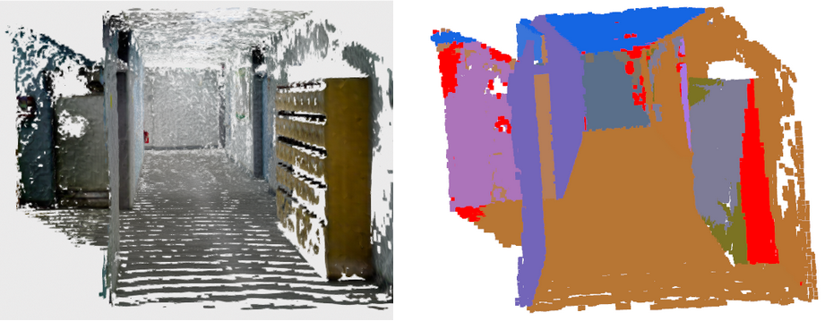

### This is the project  used for plane segmentstion using the RANSAC based on the Open3d

This project is the baseline for the plane segmentation, the project still have many drawbacks, for example, It  is lack of the intelligence to select the real plane from the hole scene

If you want to use the project, you can compile it and run the command as follows:
./MeshPlaneDetection your path to the ply file

There are still so many work to do, I hope this work can  lay a solid foundation for the future.

### 2021.07.16
Solving the KDTree Problem successfully, if you have any problems about the  KDTree, firstly I hope you can look up the source code
of the Open3D, which is quite beneficial to your understanding of the functions.
KDTreeFlann is implemented by the the template, more details could be found at the geometry/KDTreeFlann.cpp 
### Notice 
All the functions in the KDTree use the template, template <typename T>
So if you want to use the function, you must use the instantiation explicitly or implicitly.
### 2021.07.17
To make the project more portable, you can change the definition of usingMultiStageRansac to choose whether using the multi-stage Ransac or not.
Finishing the multi-stage Ransac algorithm based on the open3d, the steps are as follows:
1. Finding 20 points randomly in the whole 3D point clouds as the reference points.
2. create an KDTree, which input is the whole PointCloud.
3. For each reference point, find an optimal plane using the SegmentPlane function, in 200 points searched by KNN.
4. Find all inliers with a threshold of 0.02m that form a connected component with the reference point with respect to a grid graph on 
   the whole PointCloud.
5. Identify an optimal plane as one with the sufficient and maximum points (> 10000)
6. If the optimal plane was found, remove the Inliers corresponding to it and return to stage 1.
